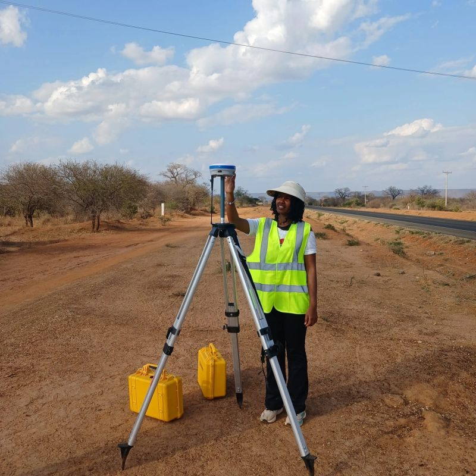

# Mapping a *more equitable* Africa through data

Geospatial Data Scientist · Climate and Social Impact Analytics · Nairobi, Kenya

{ .profile-image }

I apply geospatial technology, machine learning, and data analytics to solve real-world problems across Kenya and East Africa, from predicting climate disasters like drought and flooding to mapping femicide hotspots that can drive policy intervention and save lives.

{ .about-image }

*Fieldwork using RTK GNSS positioning during my professional attachments in Kenya.*

## Get in touch

I am open to opportunities in climate analytics, geospatial data science, and social impact research.

  <a href="mailto:jecinta.w.kinyanjui@gmail.com" style="color: #ffffff; margin-right: 8px;">✉ jecinta.w.kinyanjui@gmail.com</a> |
  <a href="tel:+254793656395" style="color: #ffffff; margin: 0 8px;">📞 +254 793 656 395</a> |
  <a href="https://www.linkedin.com/in/jecinta-wanjiru-" style="color: #ffffff; margin: 0 8px;">LinkedIn</a> |
  <a href="https://github.com/Wanjiru-1" style="color: #ffffff; margin-left: 8px;">GitHub</a>

[See my work](projects/){ .md-button .md-button--primary }
[Download CV](assets/Jecinta_Wanjiru_CV.pdf){ .md-button }
