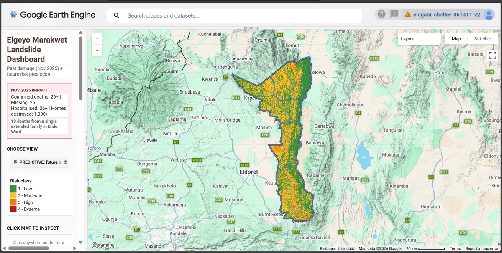

# Elgeyo Marakwet Landslide Dashboard

*November 2025 | Google Earth Engine | Sentinel-1, Sentinel-2, CHIRPS, SRTM*

**Tags:** `Google Earth Engine` `JavaScript` `Remote Sensing` `Sentinel-2` `Sentinel-1 SAR` `CHIRPS` `SRTM` `Disaster Risk Mapping` `Cartography` `Web GIS`



## The Problem

On 31 October to 3 November 2025, heavy overnight rainfall saturated the slopes of the Kerio Escarpment in Elgeyo Marakwet County, triggering shallow landslides that channelised into multiple debris flows. The Chesongoch, Murkutwo, and Kipkenda settlements were devastated, with at least 26 deaths confirmed, 25 people reported missing, and over 1,000 homes destroyed.

Elgeyo Marakwet has experienced repeated landslide events since 2010, including the Kaben landslide of 2010, the 2012 Chesongoch event, the 2019 Muino-Nyarkulian-Parua disaster (39 deaths), and the 2020 Liter/Chesegon event (18 deaths). Despite this recurring pattern, county disaster officers have lacked a quick-access tool to identify which slopes are most vulnerable before the next rainfall event.

## The Objective

Build an interactive web-based dashboard that classifies landslide susceptibility across the county into clear risk classes, displays before-and-after satellite evidence of the November 2025 event, and serves as a planning tool for disaster officers, land use planners, and at-risk communities.

## Methodology

The dashboard combines six environmental factors into a weighted susceptibility index:

```
Risk = 0.35 × slope
     + 0.20 × rainfall (7-day antecedent)
     + 0.15 × vegetation loss (NDVI change)
     + 0.15 × land cover vulnerability
     + 0.10 × slope curvature
     + 0.05 × soil moisture
```

Each input is normalised to a 0-to-1 range and combined into a final score, with higher scores indicating higher physical susceptibility to slope failure during heavy rain.

The dashboard provides four interactive layers:

* **Before/after Sentinel-2 imagery** of the November 2025 event for visual change detection
* **Sentinel-1 SAR backscatter difference** for cloud-penetrating verification of terrain disturbance
* **CHIRPS rainfall analysis** showing the 7-day rainfall total that triggered the event
* **Susceptibility classification** across the entire county, with risk classes from low (green) to extreme (red)

## Data Sources and Attribution

| Dataset | Provider | Purpose |
|---|---|---|
| Sentinel-2 SR Harmonized | ESA / Copernicus | Optical imagery, NDVI, change detection |
| Sentinel-1 GRD IW | ESA / Copernicus | SAR backscatter for cloud-penetrating analysis |
| CHIRPS Daily | UCSB Climate Hazards Center | Rainfall (5 km, 1981 to present) |
| SRTM 30 m | NASA / USGS | Elevation, slope, curvature derivation |
| ESA WorldCover 10 m | ESA / Copernicus | Land cover classification |
| SMAP L4 | NASA | Soil moisture at 9 km |
| FAO GAUL 2015 | FAO | Administrative boundaries (Kenya counties) |
| Event impact statistics | Kenya Red Cross, OCHA, CNN, Daily Nation | Casualty and displacement figures |

All datasets are openly accessible through Google Earth Engine's public catalog.

## Tech Stack

* **Google Earth Engine** (JavaScript Code Editor) for data processing and visualisation
* **GEE Apps** for public deployment
* **Sentinel-2** and **Sentinel-1** for satellite imagery
* **GEE UI library** for interactive panel and legend design

## Outcomes and Impact

The dashboard provides:

* A county-scale susceptibility map showing the slopes most likely to fail in future rainfall events
* Visual evidence of the November 2025 disturbance via NDVI change detection
* Cross-validation between optical (Sentinel-2) and radar (Sentinel-1) imagery
* Rainfall trigger analysis showing the link between antecedent rainfall and slope failure

This tool is designed to support disaster management officers in Elgeyo Marakwet County, NGOs working on climate resilience, and communities living on slope-prone terrain.

## Code and Live Dashboard

* **Live dashboard:** [View on GEE Apps](#)
* **GitHub repository:** [View source code](#)

## Reflections

This project taught me how to combine multiple Earth observation datasets into a single decision-support tool. Future work would extend the susceptibility model with machine learning calibration against historical landslide inventories, and add population exposure layers using WorldPop for risk-prioritised intervention planning.

---

[See more projects](../projects/) | [Back to home](../)
