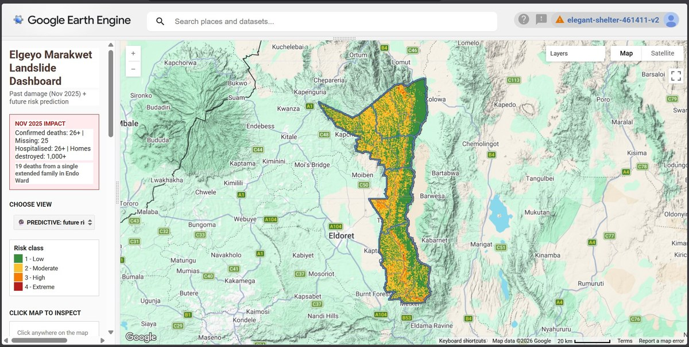
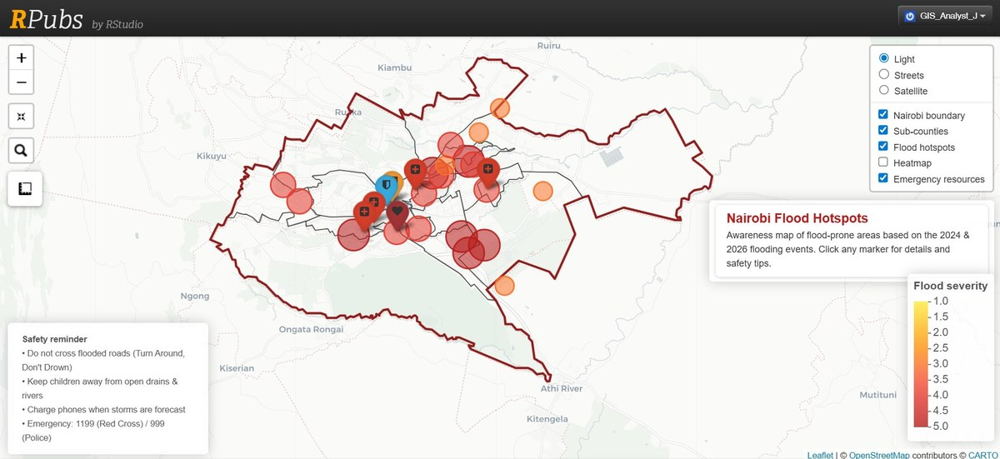
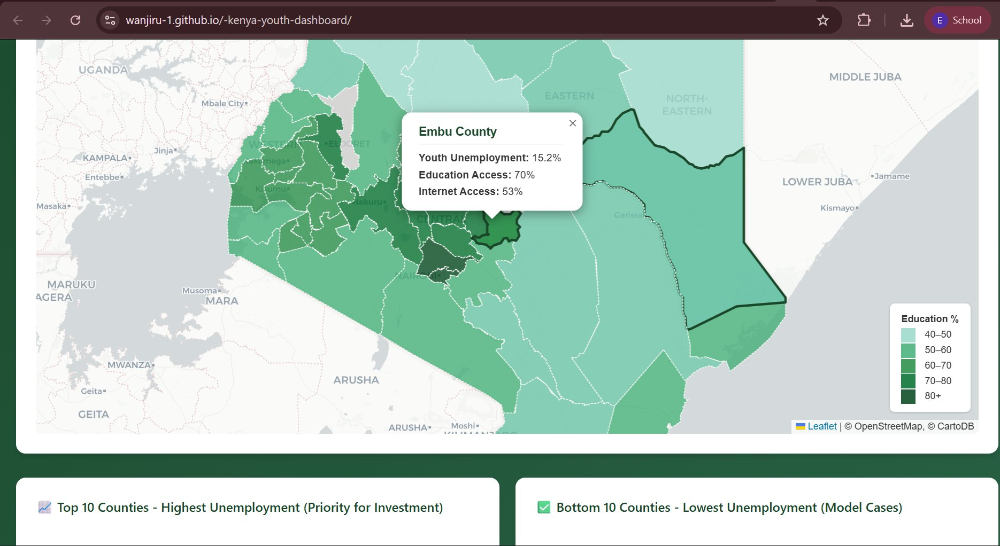

# Projects { .hero-projects }

Real-world geospatial work addressing climate risk, food security, and disaster preparedness across Kenya. Each project leads with the problem it addresses, the population it serves, and the outcomes it enables.

-   

    **Elgeyo Marakwet Landslide Dashboard**

    Interactive risk classification across an entire county, built to give disaster officers a heads-up before the next landslide event.

    *Stack: Google Earth Engine, JavaScript, Sentinel-2, SRTM*

    [Read more →](elgeyo-landslide.md)

-   

    **Nairobi Flood Hotspots**

    Citywide mapping of flood-prone zones, identifying priority areas for drainage, evacuation planning, and infrastructure investment in informal settlements.

    *Stack: Python, QGIS, Sentinel-1, Google Earth Engine*

    [Read more →](nairobi-flood-hotspots.md)

-   

    **Kenya Climate Risk Dashboard 2025**

    National-scale web maps showing drought and flood-prone zones across all 47 counties, supporting early warning systems and food security planning.

    *Stack: Google Earth Engine, Python, Leaflet*

    [Read more →](kenya-youth-dashboard.md)

## Additional work

Two further projects from my work at DRSRS:

* **Coffee Farm Geodatabase**: end-to-end digitisation and validation of 300+ smallholder coffee farm parcels, improving data accuracy for farmer land management records.
* **Cartographic Automation Pipeline**: Python and Google Earth Engine scripts to automate repetitive map production tasks, cutting production time across the team's workflow.
