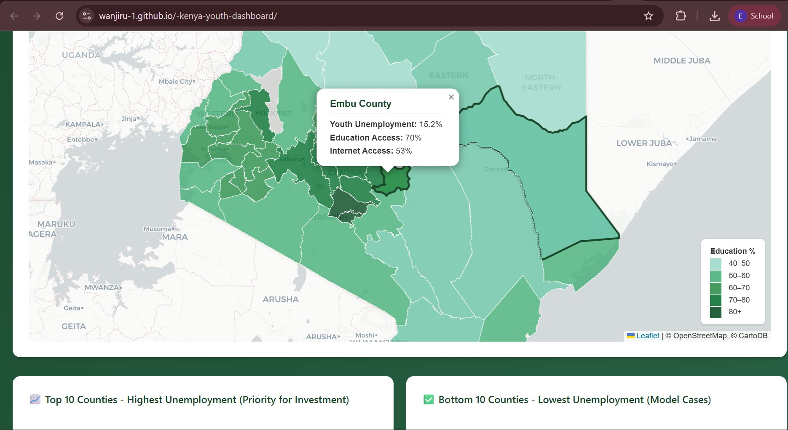

# Kenya Youth Opportunity Dashboard

*2026 | HTML5 + JavaScript + Leaflet + Plotly | Choropleth Analytics*

**Tags:** `JavaScript` `Leaflet.js` `Plotly.js` `Choropleth Mapping` `Data Storytelling` `Youth Employment` `Kenya` `47 Counties` `Web Dashboard` `GitHub Pages`

## The Problem

Kenya has one of the youngest populations in the world. Over 75% of Kenyans are under 35, and youth unemployment varies enormously across the country's 47 counties. National-level statistics flatten this story. A pastoral youth in Mandera and a tech-sector youth in Kiambu face fundamentally different opportunity structures, but most public reporting treats Kenyan youth as a single bloc.

NGOs, policymakers, and donor agencies designing interventions need a clear, visual way to see which counties carry the highest unemployment burden, where education access is weakest, and where digital connectivity is limiting job market participation.

## The Objective

Build an interactive, public-facing dashboard that surfaces three critical youth-opportunity metrics at county level:

* Youth unemployment rate (ages 15 to 34)
* Education access (secondary completion rate)
* Digital connectivity (internet access and digital literacy)

The dashboard should make regional disparities immediately visible, identify priority counties for investment, and showcase model counties whose policies could be replicated.

## Methodology

The dashboard combines four interactive components:

1. **47-county choropleth map** built with Leaflet.js, with a metric switcher that recolours the map based on the selected indicator (red for unemployment, green for education, blue for internet access)
2. **Top 10 priority counties** bar chart showing where unemployment is highest
3. **Model counties** bar chart showing the 10 best-performing counties (lowest unemployment)
4. **Correlation scatter plot** of education access against unemployment, with internet access encoded as a colour gradient

KPI cards at the top of the dashboard display national averages and the highest-opportunity county.

## Important Methodology Note

The county-level indicators displayed are **calibrated synthetic distributions**, not official statistics. Granular county-level youth unemployment data is not consistently published by the Kenya National Bureau of Statistics or the World Bank. To enable a methodological demonstration of how such a dashboard would work with real data, county-level values were synthesised using the following calibration anchors:

* National-level Kenya indicators from the World Bank
* KNBS Census 2019 demographic structure
* Known urban-to-rural development patterns
* Pastoral versus highland economic profiles

The values are designed to reflect realistic regional patterns (e.g. higher unemployment in arid northern counties, lower in central highlands) but should not be cited as authoritative county statistics. The dashboard demonstrates the analytical and visualisation methodology; future work will replace synthetic distributions with official KNBS Labour Force Survey data when it becomes available at county granularity.

## Key Findings (Based on Calibrated Distributions)

### National-level estimates
* Average youth unemployment: 20.2%
* Average education access (secondary completion): 58.4%
* Average internet access: 40.5%

### Highest unemployment counties (priority for intervention)
* Mandera (29.5%): lowest internet access at 18%
* Wajir (28.9%): severe skills gap
* Samburu (28.4%): pastoral economy challenges

### Lowest unemployment counties (model cases)
* Kiambu (11.5%): high education (82%) and connectivity (72%)
* Nairobi (12.5%): urban advantage, highest internet access (78%)
* Nyeri (13.2%): balanced development across indicators

### Patterns
* Strong negative correlation between education access and unemployment
* Northern arid counties (Mandera, Wajir, Isiolo, Turkana) show a digital connectivity gap below 25%
* Central highlands (Kiambu, Muranga, Nyeri) outperform across all three indicators

## Data Sources and Attribution

| Source | Use |
|---|---|
| World Bank Kenya Indicators | National-level calibration anchors |
| Kenya National Bureau of Statistics (KNBS) Census 2019 | Demographic structure |
| World Bank Findex 2021 | Digital inclusion benchmarks |
| Kenya County administrative boundaries (GeoJSON) | Map polygons |
| OpenStreetMap and CartoDB | Base map tiles |

## Tech Stack

* **HTML5 + Vanilla JavaScript** for the dashboard frontend
* **Leaflet.js 1.9.4** for the interactive choropleth map
* **Plotly.js 2.26.0** for analytical charts (bar charts, scatter plot)
* **Python** (separate utility script) for data preparation
* **GitHub Pages** for free static site hosting

The entire dashboard is self-contained in a single HTML file with no backend dependencies. This makes it fast-loading, easy to deploy, and accessible on mobile devices.

## Outcomes and Impact

The dashboard delivers:

* A working methodological framework for visualising county-level youth opportunity indicators
* Reusable choropleth code that can be adapted to other indicators (poverty, food security, health access)
* A demonstration of how multi-indicator development data can be communicated to non-technical decision-makers
* A foundation for upgrading to real KNBS Labour Force Survey data when published at county granularity

## Interactive Live Dashboard

<iframe src="https://wanjiru-1.github.io/kenya-youth-dashboard/" 
        width="100%" 
        height="800" 
        frameborder="0" 
        loading="lazy"
        title="Kenya Youth Opportunity Dashboard"
        sandbox="allow-scripts allow-same-origin allow-popups">
</iframe>

[:material-fullscreen: Open in Full Screen](https://wanjiru-1.github.io/kenya-youth-dashboard/){ .md-button .md-button--primary }
[:fontawesome-brands-github: View Source Code](https://github.com/Wanjiru-1/kenya-youth-dashboard){ .md-button }

**Direct links:**

* **Live Dashboard:** https://wanjiru-1.github.io/kenya-youth-dashboard/
* **GitHub Repository:** https://github.com/Wanjiru-1/kenya-youth-dashboard
* **Documentation:** README, DEPLOYMENT, and QUICK_START guides included in the repository
* **License:** MIT

## Reflections

This project taught me how to build production-ready interactive web dashboards from scratch using vanilla JavaScript and the Leaflet plus Plotly stack, rather than relying on heavyweight platforms like Power BI or Tableau. It also reinforced the importance of being explicit about data provenance: calibrated synthetic data is a legitimate methodological tool, but only when the limitation is clearly disclosed.

The natural next step is to integrate official KNBS Labour Force Survey data once available at county granularity, and to extend the dashboard with skills-gap analysis by sector (agriculture, services, technology) and time-series trends across survey rounds.

---

[← Back to all projects](../) | [Home](../../)
