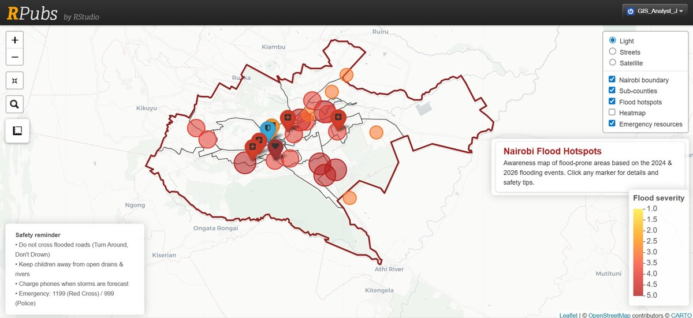

# Nairobi Flood Hotspots

*April 2024 to March 2026 events | R, Leaflet | Public awareness mapping*

**Tags:** `R` `Leaflet.js` `Cartography` `Disaster Risk Mapping` `Web Mapping` `Urban Resilience` `Public Awareness` `Open Data`

## The Problem

Nairobi's recurrent flooding disproportionately affects residents in informal settlements and low-lying neighbourhoods. The April 2024 long-rains floods displaced thousands of households across Mathare, Mukuru, Kibera, and Korogocho, with continued impacts through the March 2026 rainy season. The May 2024 Uthiru building collapse, linked to soil saturation, claimed at least 9 lives.

While disaster management agencies hold detailed records, residents and decision-makers lack a clear, public-facing tool that shows which neighbourhoods are most at risk, why they flood, and where to find emergency resources.

## The Objective

Build a public-facing interactive map that:

* Identifies and ranks 20 flood-prone zones across Nairobi by severity
* Documents the root cause of flooding in each zone (river basin, drainage failure, settlement on riparian land)
* Surfaces emergency resources including hospitals, the Red Cross, and ambulance services
* Raises awareness and supports disaster preparedness conversations at community level

## Methodology

The map integrates four data layers in a Leaflet web map:

1. **20 flood hotspot points** with severity scores (1 to 5), households affected estimates, primary cause descriptions, and associated river basin
2. **Five major river corridors** (Nairobi, Ngong, Mathare, Gatharaini, Ruiru) marking the principal flooding paths
3. **Seven emergency resource locations** (Kenya Red Cross HQ, Nairobi County Disaster Management Office, four hospitals, St John Ambulance) with toll-free contact numbers
4. **Administrative boundaries** from GADM at sub-county level

Severity is colour-coded yellow to dark red, with click-to-reveal pop-ups for each location. The map is fully interactive with zoom, pan, layer toggles, and a legend explaining symbology.

## Featured Hotspots

| Severity | Areas |
|---|---|
| 5 (Extreme) | Mathare, Mukuru kwa Njenga, Mukuru kwa Reuben, Kibera, Korogocho, Embakasi (Pipeline) |
| 4 (High) | Kawangware, Huruma, Eastleigh, South C, Industrial Area, Uthiru, Dandora, Kayole/Soweto, Lucky Summer |
| 3 (Moderate) | Githurai, Kasarani, Kiamaiko, Ruai, Syokimau |

The principal flooding drivers are the Nairobi River, Ngong River, and Mathare River corridors, compounded by encroachment on riparian land, blocked drainage, and dense informal housing.

## Data Sources and Attribution

| Source | Use |
|---|---|
| UN OCHA Kenya | Affected-population estimates |
| Kenya Red Cross Society | Emergency contacts and event documentation |
| ReliefWeb | Situation reports |
| ARIN (African Research and Impact Network) | Research briefs on Nairobi flooding |
| Daily Nation, CNN, Citizen TV | Event reporting |
| GADM (Global Administrative Areas) | Nairobi sub-county boundaries |

## Tech Stack

* **R** with `leaflet`, `leaflet.extras`, `dplyr`, `htmltools`, `htmlwidgets`, `sf`
* **GADM** via the `geodata` package for boundary data
* **htmlwidgets** for export as a standalone HTML page
* **RPubs** or **GitHub Pages** for deployment

## Outcomes and Impact

The map provides:

* A community-accessible view of where flooding has historically caused most harm in Nairobi
* A starting point for residents to identify nearby emergency resources
* A planning aid for urban resilience interventions targeting drainage, riparian land encroachment, and informal settlement upgrading
* A reproducible R workflow that can be adapted to other Kenyan cities or extended with new flood events

## Code and Live Map

* **Live interactive map:** [View on RPubs](#)
* **GitHub repository:** [View source code](#)

## Reflections

This project deepened my understanding of how public-facing geospatial communication can sit alongside formal disaster response. It also highlighted limits: the hotspot data is based on reported events, so areas with under-reporting may be under-represented. Future versions would integrate Sentinel-1 SAR flood-extent detection (cloud-penetrating radar) for an evidence-based approach to flood frequency rather than reported impact alone.

---

[See more projects](../projects/) | [Back to home](../)
